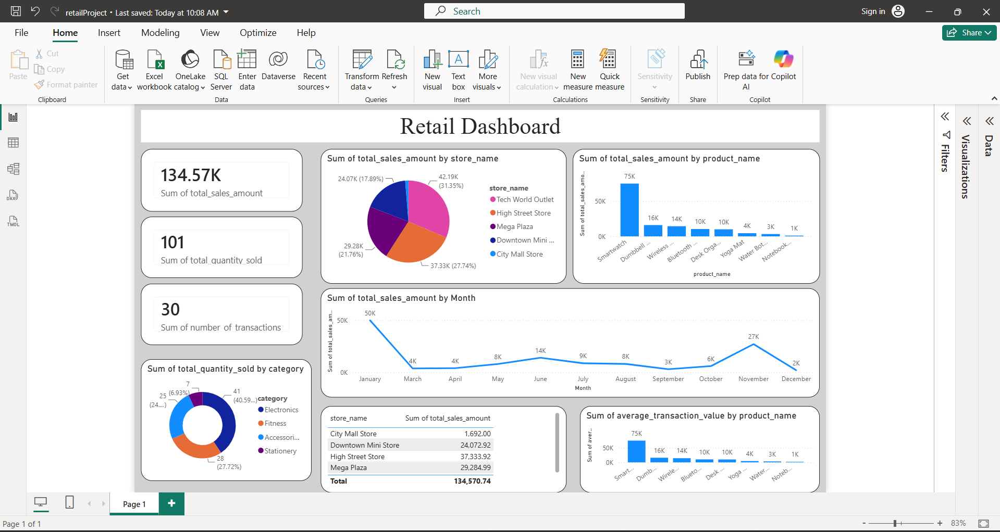

# retail-AzureProject
#  End-to-End Azure Data Engineering Pipeline

A production-grade retail data pipeline built on Azure, implementing the **Medallion Architecture** to ingest, transform, and visualize data from multiple sources through an interactive Power BI dashboard.

---

##  Architecture Overview

```
┌─────────────────────┐     ┌──────────────────────┐
│   Azure SQL DB      │     │      REST API         │
│  (transactions,     │     │  (customer JSON data) │
│   stores, products) │     │                       │
└────────┬────────────┘     └──────────┬────────────┘
         │                             │
         └─────────────┬───────────────┘
                       │  Azure Data Factory
                       │  (Parallel Copy Activities)
                       ▼
          ┌────────────────────────┐
          │    ADLS Gen2           │
          │  ┌──────────────────┐  │
          │  │   bronze/        │  │  ← Raw Parquet files
          │  │   silver/        │  │  ← Cleaned Delta Lake
          │  │   gold/          │  │  ← Aggregated Delta Lake
          │  └──────────────────┘  │
          └────────────┬───────────┘
                       │  Azure Databricks
                       │  (PySpark Transformations)
                       ▼
          ┌────────────────────────┐
          │     Power BI           │
          │  Executive Dashboard   │
          └────────────────────────┘
```

---

## Tech Stack

| Layer | Technology |
|---|---|
| Ingestion & Orchestration | Azure Data Factory (ADF) |
| Storage | Azure Data Lake Storage Gen2 (ADLS Gen2) |
| Processing & Transformation | Azure Databricks (PySpark + Delta Lake) |
| Visualization | Power BI Desktop |
| Source Databases | Azure SQL Database, REST API (HTTP) |
---


##  Power BI Dashboard

The Gold layer dataset feeds an executive Power BI dashboard with the following visuals:

| Visual | Metric |
|---|---|
| KPI Cards | Total Sales ($), Total Quantity Sold, Transaction Count |
| Line Chart | Sales trends over time (`total_sales_amount` vs `transaction_date`) |
| Pie / Donut Charts | Revenue breakdown by store and product category |
| Bar Charts | Top-performing products and category demand analysis |

---

---

## 📋 Medallion Architecture Summary

```
Bronze  →  Raw, un-cleansed Parquet files as ingested from source systems
Silver  →  Typed, deduplicated, joined Delta Lake tables with derived fields
Gold    →  Aggregated, business-ready Delta Lake tables optimised for BI consumption
```
